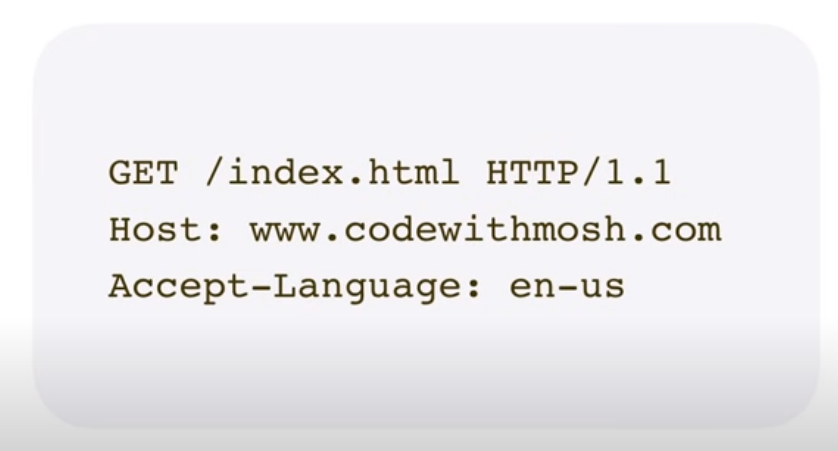

# Web development Beginner notes

- This file contains the notes of basic web development which can be helpful for understanding how thing works behind the scenes and also provides foundational information about web development which can also be asked in the interview.

## URL- Uniform Resource Locator

- How thing work when we enter URL into the browser
  - Two things involve in this step (Client server model)
      1. Client - (browser)
      2. Server - (computer which host the target website )

## HTTP - HyperText Transfer Protocol (http://)

- HTTP is a language which client and server use to talk to each other
- HTTPS which is HTTP + Encryption

### Example of HTTP message

Browser tells server what it's looking for like in the example it's asking for index.html file

- After that based on the message server understand what's client is asking then server sends the request

### Example of server response

- In the example 200 ok is status code which represents successful response
- Content type like 'text/html'
- Response also consist of Html document with content

As browser read the response HTML it constructs the DOM (Document object model)

## DOM (Document object model)

- This model represents objects and elements in our HTML document
- Elements and objects like Paragraph of text, Images, links, etc
- When browser reading the HTML document it discovers the reference to other resources like images, fonts etc and each of the resources has address or url. For each resource, browser sends separate HTTP request to server to fetch the resource. Many of these HTTP requests are send parallel so we can see the server as quickly as possible possible. Once the browser receives all the necessary resources it will render the HTML document.
  - If you want to see this step in action open the browser open [www.google.com](www.google.com) or any other website and then open dev tools then look for network tab there you will find different request GET requests and also see the internal request for images and fonts.
